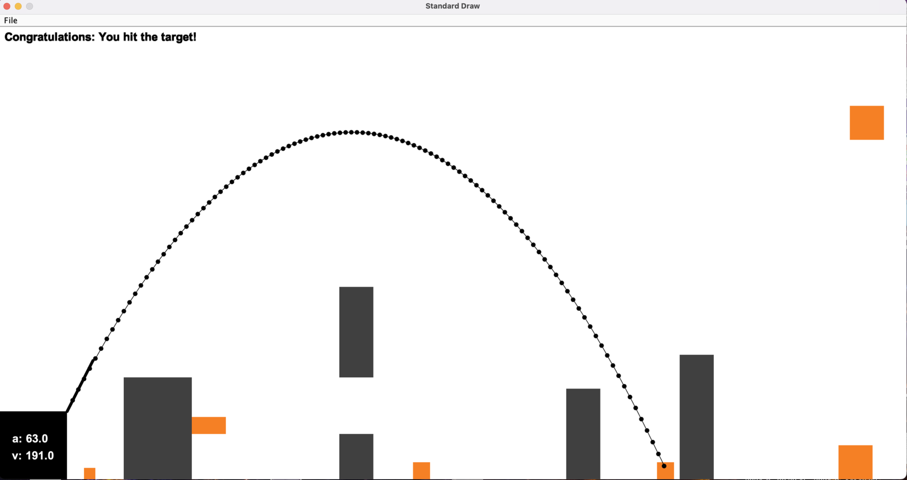

# Angry Bullets – Physics-Based Shooting Game in Java

Angry Bullets is a 2D shooting game developed in Java using the StdDraw graphics library. Players adjust the velocity and angle of a projectile to hit targets while avoiding obstacles, all governed by basic physics principles.

This project was developed as the first assignment of **CMPE160 – Object-Oriented Programming** at Boğaziçi University, Spring 2023.

## Overview

The game simulates projectile motion in a 2D environment. Players aim and shoot bullets with adjustable parameters and receive feedback based on the result of each shot (hit, collision, miss, etc.). The visual interface displays all motion and interactions in real-time.

## Features

- Physics-based projectile motion with gravity
- Adjustable velocity and angle (via keyboard input)
- Interactive visual feedback through dynamic trajectory lines
- Multiple game states:
  - Hit targets
  - Collide with obstacles
  - Miss and hit the ground
  - Bullet exits the screen or re-enters from the top

## Controls

- **Arrow Keys**
  - `↑ / ↓` to adjust angle
  - `← / →` to adjust velocity
- **Space** to fire the bullet
- **R** to reset and shoot again

## Technical Details

- **Language**: Java
- **Library**: [StdDraw](https://introcs.cs.princeton.edu/java/stdlib/javadoc/StdDraw.html)
- **Physics**:
  - Horizontal: `x(t) = x₀ + v₀ * cos(θ) * t`
  - Vertical: `y(t) = y₀ + v₀ * sin(θ) * t - ½gt²`

## File Structure

```
angry-bullets/
├── src/
│   └── Main.java
├── docs/
│   ├── report.pdf
│   └── hitexample.png
├── README.md
```

## Screenshots

### Target Hit Example



## Run Instructions

1. Ensure `StdDraw.java` is included in the `src/` directory
2. Compile and run `Main.java` using any Java IDE or `javac` / `java` from the terminal

## Course

CMPE160 – Object-Oriented Programming  
Boğaziçi University, Spring 2023

## License

This project is licensed under the MIT License. See the `LICENSE` file for details.
